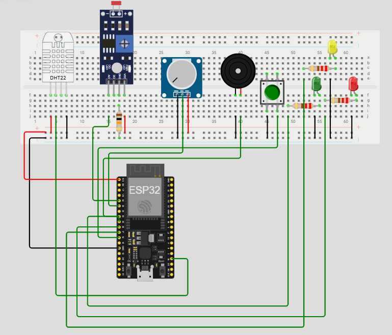
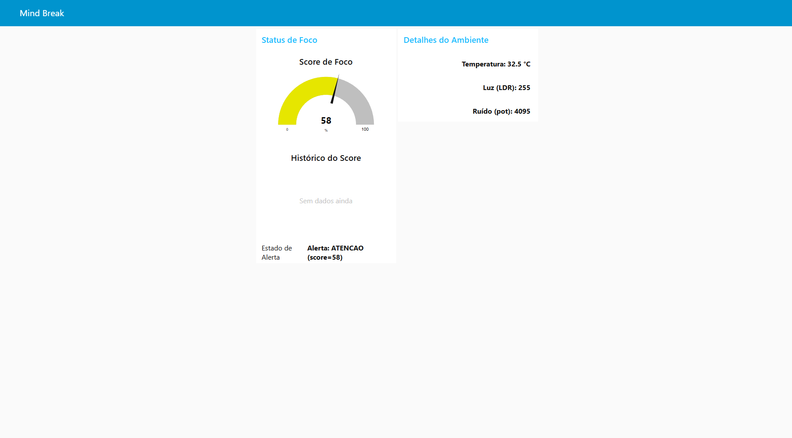
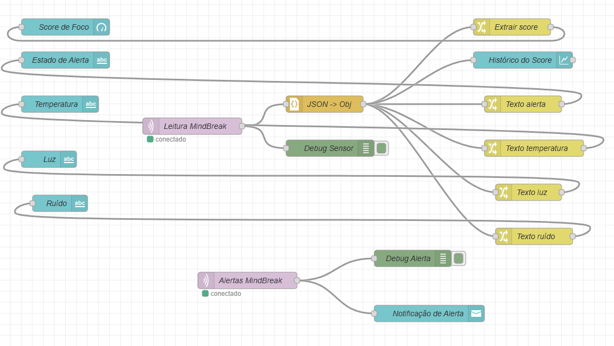

# Mind Break 
Projeto desenvolvido para a Global Solution

## 📌 1. Problema
No futuro do trabalho, as atividades estão cada vez mais digitais, flexíveis e distribuídas.
O home office e os ambientes híbridos já fazem parte da rotina — e isso deve crescer ainda mais nos próximos anos.

Mas, apesar das vantagens, esse novo modelo trouxe um desafio importante:

📉 as pessoas passam longos períodos em frente a telas, muitas vezes sem pausas, e em ambientes que não favorecem concentração ou bem-estar.

Problemas comuns incluem:

trabalhar em locais quentes ou mal ventilados;

luminosidade inadequada;

barulho constante;

longas sessões de trabalho sem descanso;

dificuldade de perceber quando o corpo e a mente começam a perder foco.

Com isso, aumentam:

cansaço mental,

queda de produtividade,

estresse,

e pior qualidade de vida.

Em um cenário onde o trabalho remoto será cada vez mais comum, monitorar o ambiente e incentivar pausas inteligentes se torna essencial para manter saúde e desempenho.

## 📌 2. Solução
O **Mind Break** é um sistema baseado em **ESP32 + sensores** que monitora o ambiente e calcula um **score de foco**, reduzindo pontos conforme:

- Temperatura alta  
- Ambiente muito escuro  
- Nível de “ruído” elevado (simulado pelo potenciômetro)  
- Tempo excessivo sem pausa  

Quando o score cai:

- LEDs indicam o estado (verde → bom | amarelo → atenção | vermelho → crítico)  
- O buzzer soa em estado crítico  
- Todos os dados são enviados via **MQTT** para um **dashboard no Node-RED**, que exibe gráficos, valores e alertas em tempo real  
- Pressionar o botão registra uma pausa → e o score volta para **100**

🎯 O objetivo é criar uma ferramenta simples que incentive melhores hábitos e auxilie no bem-estar no futuro do trabalho.

---

## 📌 3. Componentes usados (Wokwi)



- ESP32 DevKit V1  
- DHT22 (temperatura e umidade)  
- LDR (luminosidade)  
- Potenciômetro (ruído simulado)  
- LEDs (verde, amarelo e vermelho)  
- Buzzer  
- Botão (pull-up interno)  
- Protoboard + jumpers  

### ➜ Projeto completo no Wokwi:
**https://wokwi.com/projects/448106003420046337**

---

## 📌 4. Estrutura do Repositório

/
├── mindbreak.ino               # Código completo do projeto (ESP32 + score + MQTT)
├── mindbreak_flow.json         # Fluxo do Node-RED utilizado no dashboard
├── link.txt                    # Link direto para o projeto no Wokwi
├── /images                     # Prints utilizados no README
│   ├── circuito_wokwi.png
│   ├── dashboard_node_red.png
│   ├── fluxograma_node_red.png
│   └── leds_buzzer.png
└── README.md                   # Documentação oficial do projeto

---

## 📌 5. Como executar

### ✔ ESP32 (Arduino / Wokwi)
- Abra o projeto no Wokwi e clique em **Run**
- O ESP32 conecta automaticamente ao WiFi:
  - SSID: `Wokwi-GUEST`  
  - Sem senha  
- Conecta ao broker MQTT:
  - `test.mosquitto.org`
- Começa a enviar os dados para os tópicos:  
  - `mindbreak/sensor`  
  - `mindbreak/alerta`

### ✔ Dashboard Node-RED
1. Abra o Node-RED  
2. Menu → **Import**  
3. Cole o conteúdo de `mindbreak_flow.json`  
4. Deploy  
5. Acesse a dashboard:  
   **http://localhost:1880/ui**  

---

## 📌 6. Funcionamento do Score

O sistema inicia com **score = 100**, e a cada 5 segundos:

| Condição | Penalidade |
|---------|------------|
| Temperatura > 28°C | –3 |
| Luz baixa (LDR < 2000) | –2 |
| Ruído alto (pot > 3000) | –3 |
| Muito tempo sem pausa (> 30s) | –5 |
| Ambiente perfeito | +1 (recuperação) |
| Botão apertado | score volta para **100** |

### Indicadores no dispositivo:
- **Verde** → foco bom  
- **Amarelo** → atenção  
- **Vermelho** → crítico  
- **Buzzer** → crítico intenso (score < 20)

---

## 📌 7. MQTT — Tópicos e Mensagens

O projeto utiliza dois tópicos principais no broker MQTT: `mindbreak/sensor` e `mindbreak/alerta`.

### 7.1. Tópico `mindbreak/sensor`

Tópico usado para enviar o “estado completo” do sistema em formato JSON.  
Exemplo de mensagem:

```json
{
  "temperatura": 26.3,
  "luz": 1800,
  "ruido": 3200,
  "tempoSemPausa": 45,
  "score": 62,
  "alerta": "ATENCAO"
}
```

### Campos do JSON (publicado em `mindbreak/sensor`)

- **temperatura** *(float ou null)*: leitura do DHT22 em °C.  
  - Caso a leitura falhe, o campo é enviado como `null`.

- **luz** *(int)*: valor bruto do LDR (0–4095).  
  - Valores menores indicam ambiente mais escuro.

- **ruido** *(int)*: valor do potenciômetro (0–4095), usado como simulação de ruído.

- **tempoSemPausa** *(int)*: tempo, em segundos, desde a última pausa registrada pelo botão.

- **score** *(int)*: score de foco atual, variando de 0 a 100.

- **alerta** *(string)*: nível de atenção calculado pelo sistema:  
  - `"OK"` → score ≥ 70  
  - `"ATENCAO"` → 40 ≤ score < 70  
  - `"CRITICO"` → score < 40

Esse tópico é utilizado pelo Node-RED para alimentar:

- o **gauge de score**,  
- o **gráfico histórico do score**,  
- os **textos de detalhes** (temperatura, luz e ruído) exibidos no dashboard.

### **7.2. Tópico `mindbreak/alerta`**

Este tópico é usado para **notificações rápidas**.

Sempre que o score fica **abaixo de 40** (estado crítico), o ESP32 publica uma mensagem simples, por exemplo:

ALERTA: Score de foco baixo, sugerir pausa!


No fluxo do Node-RED, esse tópico é utilizado para:

- Exibir a mensagem no **nó debug** (útil para testes).
- Disparar um **ui_toast** (notificação visual) no dashboard, chamando atenção do usuário para a necessidade de pausa.

---

## 📌 8. Dashboard Node-RED

## 8. Dashboard Node-RED



O dashboard foi desenvolvido usando o `node-red-dashboard`, com foco em clareza e monitoramento em tempo real.

Ele é composto por dois grupos:

### **• Status de Foco**
- **Gauge (Score de Foco):** representa o score entre 0 e 100.
- **Gráfico do Score:** histórico com atualização automática.
- **Texto de Alerta:** mostra se o estado atual é OK, ATENÇÃO ou CRÍTICO.

### **• Detalhes do Ambiente**
- **Temperatura atual** (ou N/A se leitura falhar)
- **Luminosidade (LDR)**
- **Ruído simulado (potenciômetro)**

### **Notificações**
Quando o ESP32 publica no tópico `mindbreak/alerta`, o Node-RED exibe um **toast** visual de aviso, chamando a atenção para score baixo.

### **Fluxo**
O arquivo `mindbreak_flow.json` contém todo o fluxo pronto para importação:
- Leitura dos tópicos MQTT
- Conversão JSON → objeto
- Separação dos dados
- Renderização no dashboard
- Exibição de alertas



